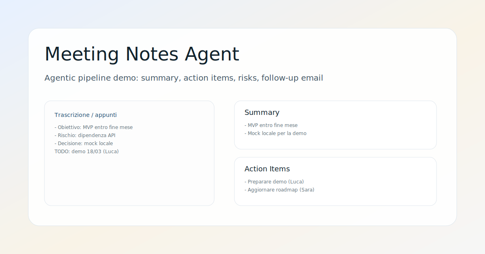

# Meeting Notes Agent


Web app open source per trasformare note di riunione in output operativi: summary, action items, rischi/blocchi e una mail di follow-up. Il progetto dimostra un flusso "agentic" semplice e trasparente, con pipeline multi-step e integrazione LLM opzionale.



## Funzionalita principali
- Summary strutturato in punti
- Action items con owner e scadenza
- Rischi e blocchi evidenziati
- Email di follow-up pronta da inviare
- Copia negli appunti e export Markdown
- Modalita LLM opzionale con fallback euristico

## Demo rapida
1. Avvia il backend
2. Avvia il frontend
3. Incolla appunti o usa l'esempio e premi "Esegui agente"

## Architettura
- `backend/`: Spring Boot, API REST e pipeline agent
- `frontend/`: Angular, UI minimale

La pipeline esegue step separati (summary, action items, rischi, email). Se l'LLM non e configurato, usa regole euristiche in locale.

## Requisiti
- Java 17+ (JDK consigliato)
- Node.js 18+

## Backend (Spring Boot)

### Avvio
```bash
cd backend
mvn spring-boot:run
```

Se preferisci usare il wrapper:
```powershell
cd backend
$env:JAVA_HOME="<percorso-java>"
$env:Path="$env:JAVA_HOME\bin;$env:Path"
.\mvnw.cmd spring-boot:run
```

### API
`POST /api/analyze`

Body:
```json
{
  "transcript": "testo appunti...",
  "language": "it"
}
```

Risposta:
```json
{
  "summary": ["..."],
  "actionItems": [{"task":"...","owner":"...","dueDate":"..."}],
  "risks": ["..."],
  "followUpEmail": "...",
  "pipeline": "heuristic" | "llm:chat-completions"
}
```

## Frontend (Angular)

```bash
cd frontend
npm install
npm run start
```

Apri `http://localhost:4200`.

## Integrazione LLM (opzionale)
Il backend supporta un endpoint compatibile con Chat Completions. Se configuri le variabili sotto, la pipeline usa l'LLM; altrimenti usa il fallback euristico.

Variabili richieste:
- `LLM_BASE_URL` (es. `https://api.openai.com/v1`)
- `LLM_API_KEY`
- `LLM_MODEL`

Esempio Windows (PowerShell):
```powershell
$env:LLM_BASE_URL="https://api.openai.com/v1"
$env:LLM_API_KEY="<la-tua-chiave>"
$env:LLM_MODEL="<il-tuo-modello>"
```

Nota: conserva sempre la chiave API solo lato backend e non committarla.

## Privacy
- Nessun dato viene salvato su database.
- Le note restano in memoria durante la richiesta.
- Se abiliti l'LLM, i testi vengono inviati al provider configurato.

## Roadmap
- Storico analisi locale
- Export PDF
- Template di follow-up personalizzabili

## Licenza
Questo progetto e rilasciato sotto licenza MIT.

---

Progetto pensato per un techfolio: piccolo, completo e facilmente estendibile.
